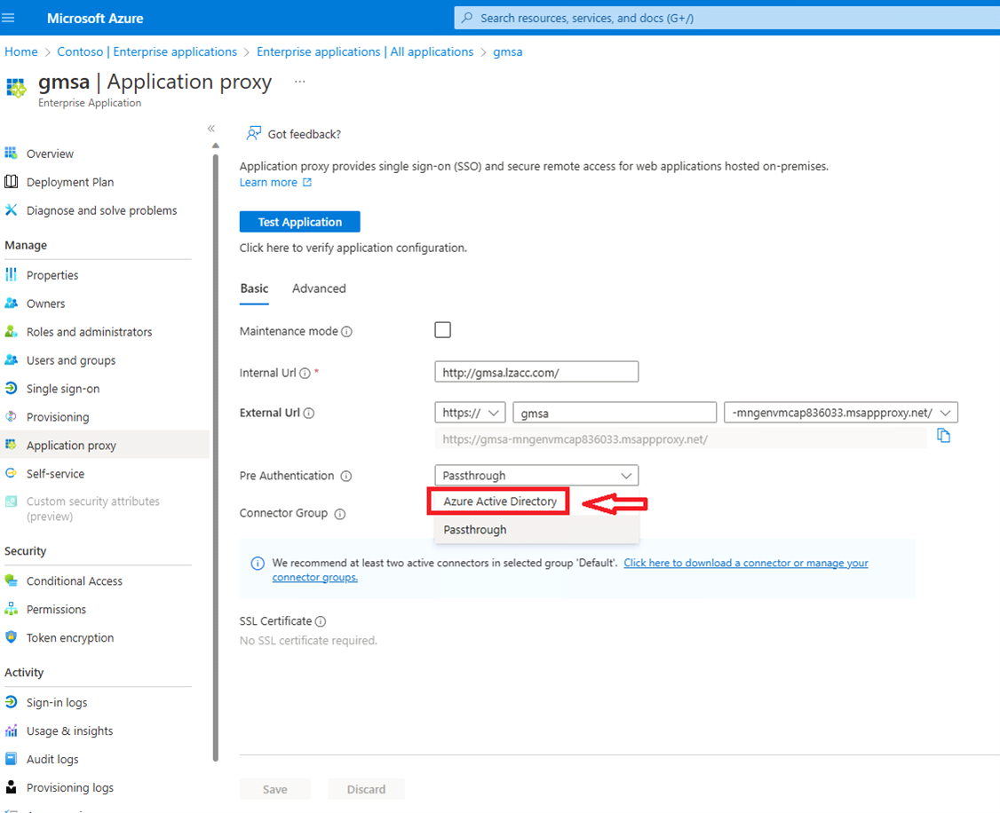

# Create the Ingress Configuration for GMSA

You will be creating or updating the following:
* Azure Application Proxy
* Azure Front Door

## Create Azure Application Proxy
Azure Application Proxy helps route the incoming request from Front Door to the application on AKS. Currently, Azure Application Proxy can't be created through Terraform and has to be created manually. As a reminder, you will need Global Admin on your Azure AD tenant to complete this step. 

1. Follow the [Microsoft Learn docs](https://learn.microsoft.com/azure/active-directory/app-proxy/application-proxy-add-on-premises-application#install-and-register-a-connector) from "Install and Register a connector" until you get to "Test the sign-on". Please see notes below before proceeding.
   - The connector you will be installing should be downloaded to your domain controller that you created in the previous steps.
   - Azure Application Proxy supports Passthrough or Azure AD for pre-authentication of a user's access request. We recommend using Azure AD for pre-authentication. If you choose not to use Azure AD for pre-authentication, users can hit your application directly without going through Azure Front Door.
   
   
## Update the routing rules for Azure Front Door

1. Navigate to your Front Door instance created in your spoke resource group.
1. Click **Add a route**.
1. Add an origin group as show below:
   
1. Add an origin as show below:
   
1. Add a WAF policy as show below:
   

# Next Steps
- [Cleanup](../../Terraform/../AKS-Secure-Baseline-PrivateCluster/Terraform/10-cleanup.md)